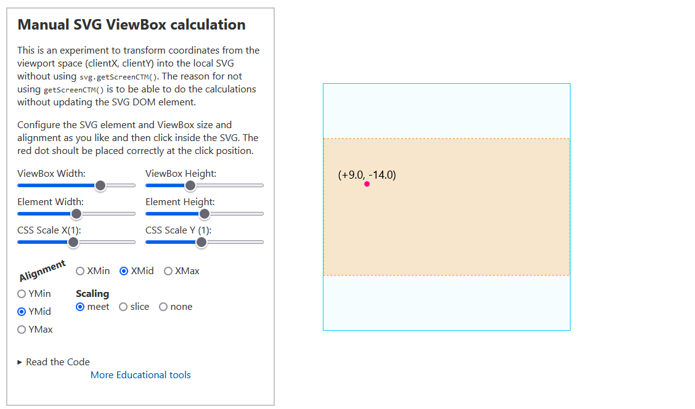

[Live Demo](https://static.laszlokorte.de/svg-viewbox-trans/)

# Manual SVG ViewBox calculation

This is an experiment to transform coordinates from the viewport space (`clientX`, `clientY`) into the local SVG without using `svg.getScreenCTM()`. The reason for not using `getScreenCTM()` is to be able to do the calculations without updating the SVG DOM element.

Configure the SVG element and ViewBox size and alignment as you like and then click inside the SVG. The red dot shoult be placed correctly at the click position.